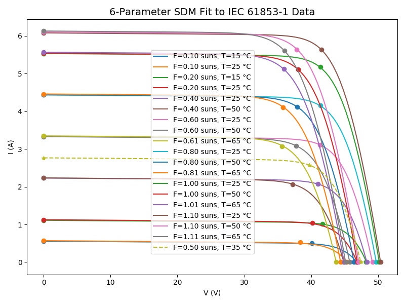

# pvfit.modeling.dc.single_diode

**Current-voltage (I-V) relationships for the single-diode model (SDM) of photovoltaic (PV) devices**

## Up and Running in 5 Minutes

First, make sure that you have followed the package setup instructions
[here](../../../README.md#Up-and-Running-in-5-Minutes).

### Single-Diode Equation (constant irradiance and temperature)

#### Load Measurement Data, Calibrate, and Compute an I-V Curve

The [pvfit.modeling.dc.single_diode.equation](equation.py) module comes with a demonstration. Get started by reading
through and executing the script [getting_started_equation.py](demos/getting_started_equation.py) from within the
[demos](demos) directory—
```terminal
python getting_started_equation.py
```
which should print out some interesting information and ultimately this pretty graph—


### Single-Diode Model (variable irradiance and temperature)

#### Load Measurement Data, Calibrate, and Compute an I-V Curve

The [pvfit.modeling.dc.single_diode.model](model.py) module comes with a demonstration. Get started by reading
through and executing the script [getting_started_model.py](demos/getting_started_model.py) from within the
[demos](demos) directory—
```terminal
python getting_started_model.py
```
which should print out some interesting information and ultimately this pretty graph—




## API Notes

TODO

## Modeling Approach

TODO

## Algorithms

TODO
